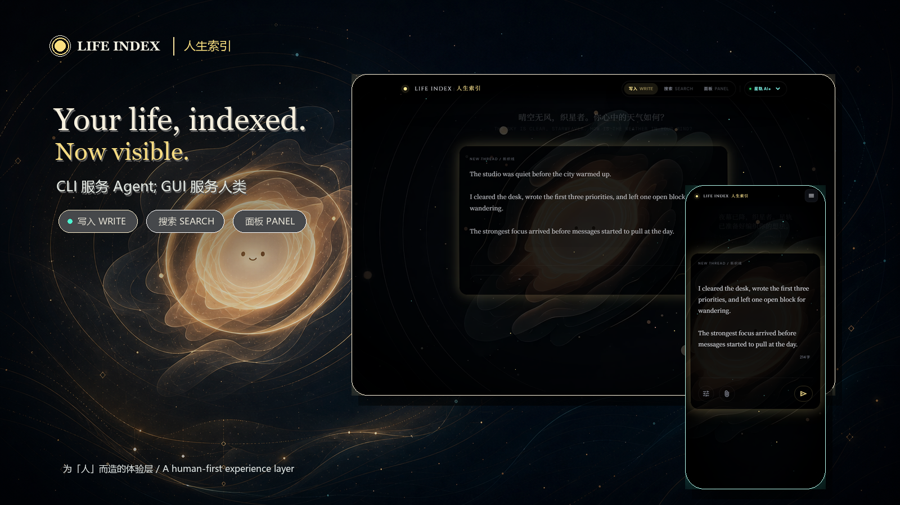
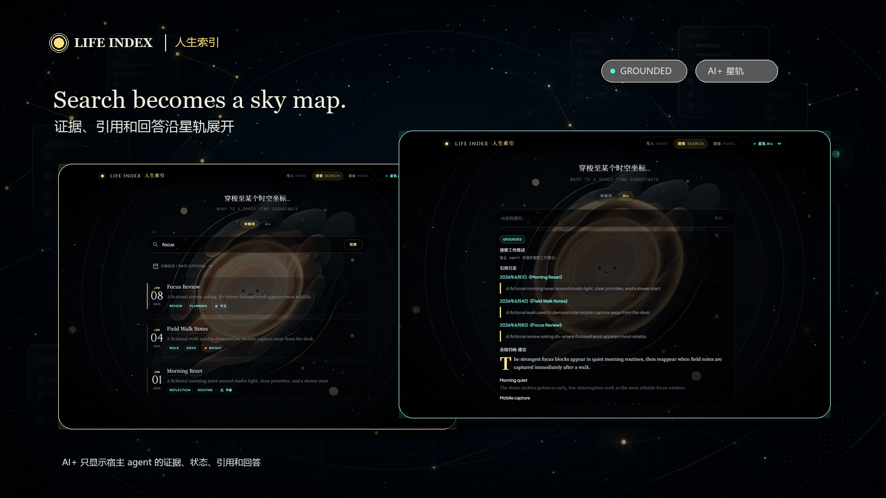
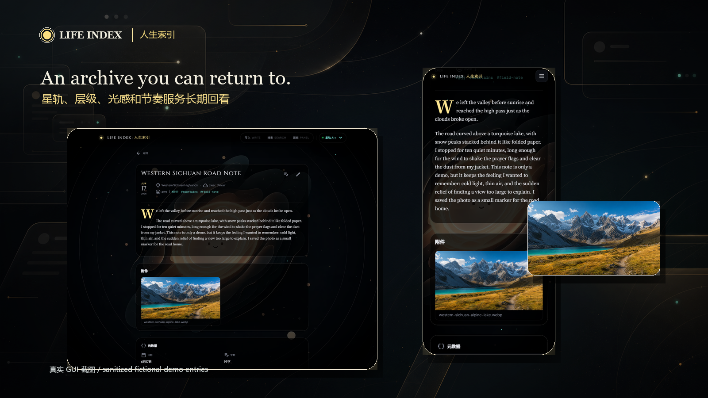
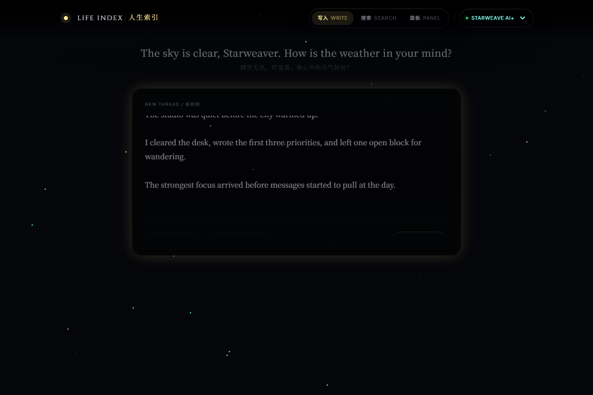
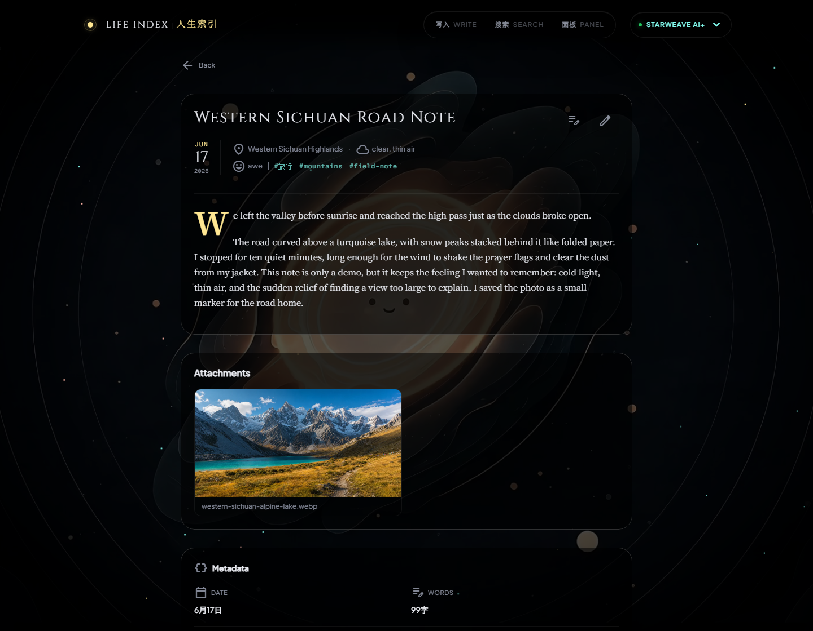
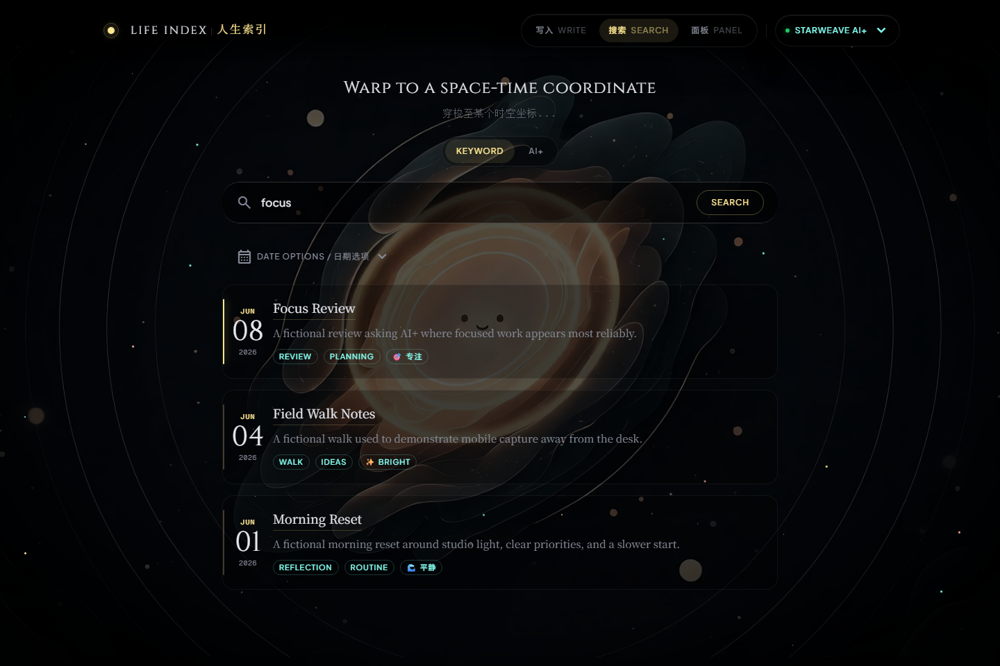
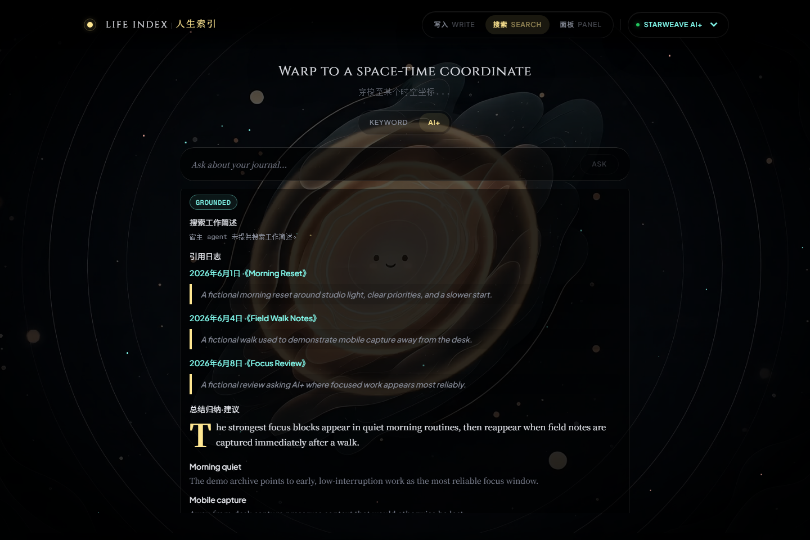

<h1 align="center">Life Index GUI</h1>

<p align="center">
  <em>Your life, indexed. Now visible.</em>
</p>

<p align="center">
  <strong>Life Index CLI serves your agent. Life Index GUI serves you.</strong><br />
  The GUI is the human experience layer built on the Life Index CLI foundation: writing, search, review, AI+ evidence panels, and temporary mobile access.
</p>

<p align="center">
  <a href="README.md">中文</a>
</p>

<p align="center">
  <a href="https://github.com/DrDexter6000/life-index-gui/actions/workflows/ci.yml"></a>
  
  
  
  
</p>

<p align="center">
  
</p>

<p align="center">
  <a href="#tldr">TL;DR</a> ·
  <a href="#why-life-index-gui">Why GUI</a> ·
  <a href="#three-promises">Three Promises</a> ·
  <a href="#real-interface">Real Interface</a> ·
  <a href="#quick-start">Quick Start</a> ·
  <a href="#upgrade">Upgrade</a> ·
  <a href="#architecture--cli-relationship">Architecture</a>
</p>

---

## TL;DR

Life Index CLI is the native tool layer for agents. Life Index GUI is the experience layer for human users. The CLI owns durable data and deterministic capability boundaries; the GUI turns writing, search, review, mobile access, and AI+ results into an interface people can actually live with.

The GUI also consumes CLI entity-graph returns: search can show entity-expansion attribution, entity links open profile pages, and review cards let you preview and confirm CLI-backed entity maintenance. See [CHANGELOG.md](CHANGELOG.md) for release scope and `/api/version` for local compatibility.

<p align="center">
  
</p>

<p align="center">
  
</p>

<p align="center">
  
</p>

```text
Human -> Life Index GUI -> FastAPI backend -> Life Index CLI -> local archive
Human -> Life Index GUI -> FastAPI backend -> optional host agent -> Life Index CLI
```

- **A human-first experience layer**: human experience still matters in an agent-native world.
- **UI/UX with the ambition of an artful indie game**: star trails, layered surfaces, light, and rhythm serve long-term review instead of turning a personal archive into an admin form.
- **Mobility beyond the desk**: keep the agent running on the home machine while a temporary secure path lets the GUI travel with your phone.

## Why Life Index GUI

The Life Index core is useful to agents, but humans need a surface that is scannable, calm, and worth returning to. The GUI does not replace the CLI and does not add its own intelligence layer; it presents CLI-backed data and host-agent results so the archive becomes a daily interface, not just command output.

| If you want | Use |
| --- | --- |
| A stable, deterministic, composable life-archive tool layer for agents | Life Index CLI |
| A writing, search, review, and mobile interface for yourself | Life Index GUI |
| Planning, multi-hop retrieval, reasoning, synthesis, and model choice | Your host agent |

## Three Promises

| Promise | Meaning |
| --- | --- |
| Human experience first | The GUI serves human users: quiet writing, scannable search, traceable evidence, and mobile capture without interrupting the moment. |
| Faithful boundaries | The GUI/backend do not directly read or write journals, attachments, indexes, SQLite caches, or entity graphs; durable data access goes through the CLI contract. |
| Intelligence belongs to the host | AI+ Star Trail only performs the handoff and renders evidence, status, citations, and output; the GUI does not bundle a model, pick a provider, or pretend to have its own mind. |

## Real Interface

These screenshots are rendered by the real GUI against sanitized fictional demo entries.

<p align="center">
  
</p>

<p align="center">
  
</p>

<p align="center">
  
</p>

<p align="center">
  
</p>

AI+ Star Trail sends your question to your host agent. The host agent uses the Life Index CLI to retrieve evidence and synthesize a grounded answer. When no host agent is connected, AI+ honestly appears `offline` / `unavailable`; deterministic writing, keyword search, and local browsing still work.

## Quick Start

Prerequisites:

- Node.js 22+
- Python 3.11-3.13 (`pydantic-core` / `Pillow` wheels are not yet available for Python 3.14 in this pinned dependency set)
- Life Index CLI installed and runnable locally
- Optional: a host agent for AI+ grounded answers / smart metadata
- Optional: `cloudflared` for temporary phone access (the only supported public tunnel)

```bash
git clone https://github.com/DrDexter6000/life-index-gui.git
cd life-index-gui
npm ci --include=dev
python -m venv .venv
source .venv/bin/activate   # Windows PowerShell: .venv\Scripts\Activate.ps1
pip install -r backend/requirements.txt
```

The local dev, test, and build tools (`vite` / `typescript` / `vitest` / `eslint` / `tailwindcss`) live in devDependencies. `npm ci --include=dev` overrides `NODE_ENV=production` or `npm config omit=dev`, avoiding `vite: not found` or build failures.

Terminal 1, start the backend:

```bash
python -m uvicorn backend.main:app --host 127.0.0.1 --port 8000
```

Terminal 2, start the frontend:

```bash
npm run dev
```

Open:

```text
http://127.0.0.1:5173
```

Production build:

```bash
npm run build
```

## Upgrade

Host agents should start with the GUI upgrade atom:

```bash
npm run gui-upgrade:plan
npm run gui-upgrade:apply
```

It checks and applies safe local git, Node, Python backend, CLI feature-gate, and `verify-stack` recovery through fail-closed JSON. For the complete upgrade and operations steps, see [docs/AGENT_UPDATE_PLAYBOOK.md](docs/AGENT_UPDATE_PLAYBOOK.md).

## Temporary Phone Access

Public links are explicit risk operations. They currently support only `cloudflared` Quick Tunnel; SSH/ngrok/frp paths are not supported. Stop the link when you are done. If generation fails, the GUI fails closed instead of exposing a half-configured link.

Host agents and headless sessions can run:

```bash
npm run remote-link:start
npm run remote-link:status
npm run remote-link:stop
```

`remote-link:start` verifies the local GUI stack, then reuses the same backend
public-link logic as the desktop button and prints a `gui.remote_link.v1` JSON
envelope. Relay `url` and `one_time_code` to the user. `expires_at` is the
tunnel TTL; `code_expires_at` is the short-lived one-time code expiry. Control
operations remain local; the public tunnel reaches only the token-gated GUI data
plane.

Windows users can also use the bundled PowerShell helper to start the stable mobile stack, `cloudflared` Quick Tunnel, and one-time code:

```powershell
powershell.exe -NoProfile -ExecutionPolicy Bypass -File scripts/start-mobile-cloudflare-tunnel.ps1
```

Native Linux / WSL shells do not currently run this `.ps1` helper directly. If you need a manual `cloudflared` path, keep the same token-gated backend constraint and start three terminals:

```bash
# Terminal 1: generate temporary session values and start the backend
SESSION_TOKEN="$(node -e "console.log(crypto.randomBytes(32).toString('base64url'))")"
ONE_TIME_CODE="$(node -e "console.log(crypto.randomBytes(24).toString('base64url'))")"
CODE_EXPIRES_AT="$(node -e "console.log(Math.floor(Date.now() / 1000) + 600)")"
printf 'Open /link?code=%s after cloudflared prints the public host\n' "$ONE_TIME_CODE"

LIFE_INDEX_PUBLIC_LINK_SESSION_TOKEN="$SESSION_TOKEN" \
LIFE_INDEX_PUBLIC_LINK_ONE_TIME_CODE="$ONE_TIME_CODE" \
LIFE_INDEX_PUBLIC_LINK_CODE_EXPIRES_AT="$CODE_EXPIRES_AT" \
python -m uvicorn backend.main:app --host 127.0.0.1 --port 8000
```

```bash
# Terminal 2: build and start the stable frontend proxy
npm run build
node scripts/mobile-acceptance-server.mjs --host 127.0.0.1 --port 5173 --backend http://127.0.0.1:8000 --dist dist
```

```bash
# Terminal 3: expose only the frontend proxy through cloudflared
cloudflared tunnel --url http://127.0.0.1:5173
```

Open `https://<cloudflared-host>.trycloudflare.com/link?code=<ONE_TIME_CODE>`. This manual path still supports only `cloudflared`; SSH/ngrok/frp are not supported. Stop all three terminal processes when finished.

## Architecture / CLI Relationship

- **CLI** is the data and capability SSOT. It is built for agents and exposes deterministic writing, search, maintenance, and indexing tools.
- **Host agent** is the intelligence layer. It plans, retrieves, reasons, synthesizes, and chooses its own model/runtime; the GUI/backend only forwards requests to the bridge configured by `LIFE_INDEX_HOST_AGENT_URL`. The public handoff is a versioned protocol, conformance kit, and multiple provider-neutral reference adapters in [docs/HOST_AGENT_HANDOFF.md](docs/HOST_AGENT_HANDOFF.md).
- **GUI** is the experience layer. It presents CLI-backed data, relays AI+ handoff requests, and renders evidence and status.
- **Data stays separate from program code**. The GUI/backend must not directly read or write journals, attachments, indexes, SQLite caches, entity graph files, or user-data directories. Durable data access goes through the CLI contract.

## Design And Contributing

- Design tokens: [design/tokens.json](design/tokens.json)
- Architecture: [docs/ARCHITECTURE.md](docs/ARCHITECTURE.md)
- GUI/CLI contract: [docs/GUI_CLI_CONTRACT.md](docs/GUI_CLI_CONTRACT.md)
- Host Agent Handoff contract / Conformance Kit: [docs/HOST_AGENT_HANDOFF.md](docs/HOST_AGENT_HANDOFF.md)
- Docs index: [docs/README.md](docs/README.md)

## License

[GNU Affero General Public License v3.0](LICENSE) (`AGPL-3.0-only`).

Plain-language summary: local use, personal journaling, and running Life Index GUI on your own machine are unaffected. If you offer a hosted or networked derivative service based on a modified version, AGPL requires you to publish the corresponding service source and modifications.
