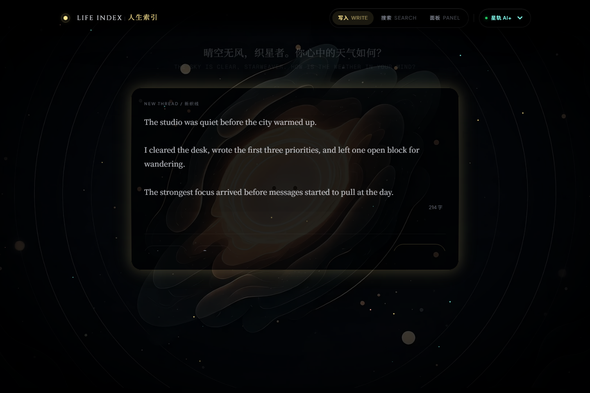
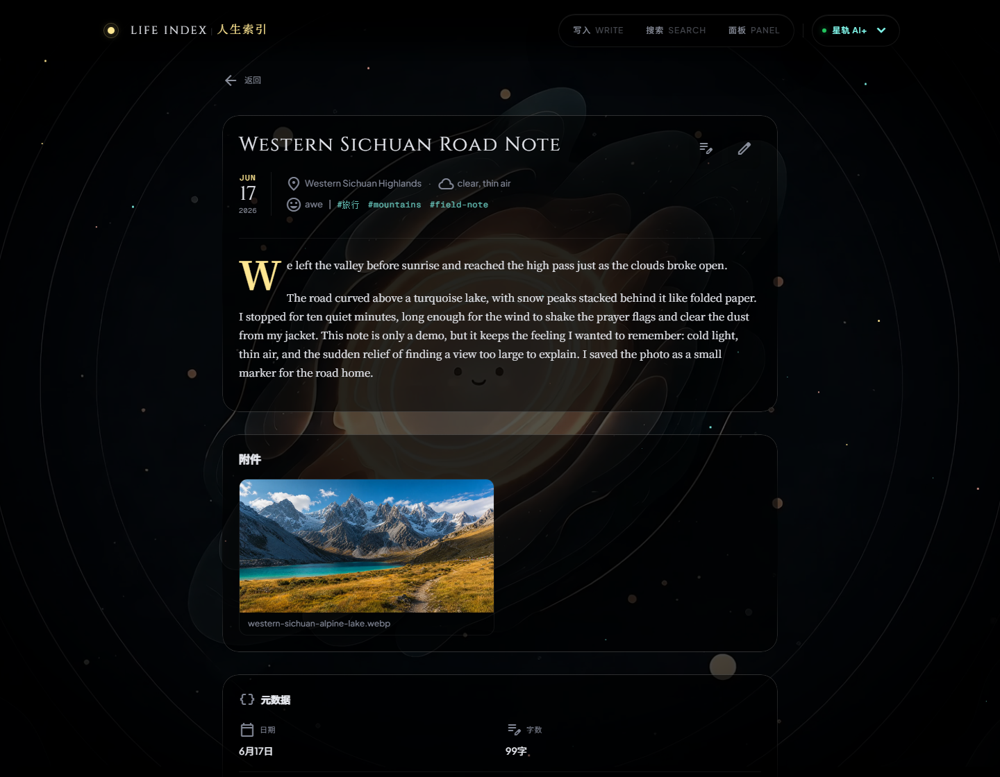
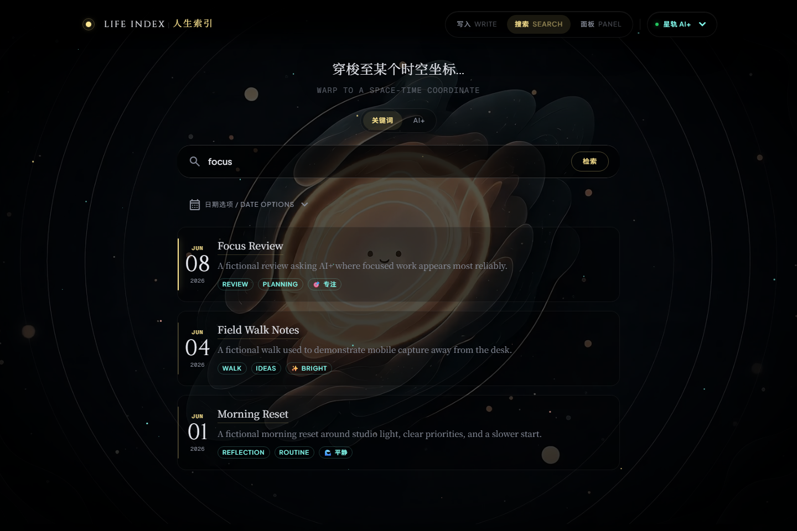
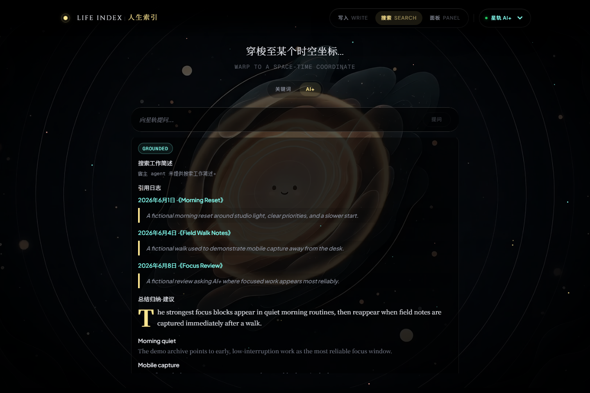

<h1 align="center">Life Index GUI | 人生索引</h1>

<p align="center">
  <em>Your life, indexed. Now visible.</em>
</p>

<p align="center">
  <strong>Life Index CLI 服务 Agent; Life Index GUI 服务人类用户。</strong><br />
  GUI 是建在 Life Index CLI 地基上的体验层：写入、搜索、回看、AI+ 证据面板和临时移动访问，都以人的使用感为中心。
</p>

<p align="center">
  <a href="README.en.md">English</a>
</p>

<p align="center">
  <a href="https://github.com/DrDexter6000/life-index-gui/actions/workflows/ci.yml"></a>
  
  
  
  
</p>

<p align="center">
  
</p>

<p align="center">
  <a href="#tldr">TL;DR</a> ·
  <a href="#为什么需要-life-index-gui">为什么需要 GUI</a> ·
  <a href="#三个承诺">三个承诺</a> ·
  <a href="#真实界面">真实界面</a> ·
  <a href="#快速开始">快速开始</a> ·
  <a href="#架构--与-cli-关系">架构</a>
</p>

---

## TL;DR

Life Index CLI 是给 Agent 的原生工具层；Life Index GUI 是给人类用户的体验层。CLI 负责可靠的数据与能力边界，GUI 负责把写入、搜索、回看、移动访问和 AI+ 结果呈现成一个可以长期使用的界面。

```text
Human -> Life Index GUI -> FastAPI backend -> Life Index CLI -> local archive
Human -> Life Index GUI -> FastAPI backend -> optional host agent -> Life Index CLI
```

- **为「人」而造的体验层**：人机共生时代，人类体验同样值得被认真对待。
- **媲美艺术独立游戏的 UI/UX**：星轨、层级、光感和节奏服务长期回看，而不是把个人档案变成后台表单。
- **走出家门的移动性**：Agent 留在家中主机上运行，Life Index 通过安全的临时访问路径装进手机。

## 为什么需要 Life Index GUI

Life Index 的底层能力适合 Agent 调用，但人需要一个可扫描、可停留、可反复使用的界面。GUI 不是替代 CLI，也不是在本地塞一个“智能系统”；它把 CLI-backed 数据和宿主 agent 的结果呈现出来，让人生档案从命令输出变成可用的日常工具。

| 如果你想要 | 用什么 |
| --- | --- |
| 给 agent 一个稳定、确定、可组合的人生档案工具层 | Life Index CLI |
| 给自己一个写入、搜索、回看和移动访问的界面 | Life Index GUI |
| 规划、多跳检索、推理、合成、模型选择 | 你的宿主 agent |

## 三个承诺

| 承诺 | 含义 |
| --- | --- |
| 人类体验优先 | GUI 服务人类用户：写入安静、搜索可扫、证据可追、移动访问不打断现场记录。 |
| 忠实边界 | GUI/backend 不直接读写 journals、附件、索引、SQLite 缓存或实体图谱；持久数据访问走 CLI contract。 |
| 智能归宿主 | AI+ 星轨只发起 handoff 并显示证据、状态、引用和回答；GUI 不内置模型、不选择供应商、不假装自己有心智。 |

## 真实界面

以下截图由真实 GUI 在脱敏演示语料上渲染，不含真实日记内容。

<p align="center">
  
</p>

<p align="center">
  
</p>

<p align="center">
  
</p>

<p align="center">
  
</p>

AI+ 星轨把问题交给你的宿主 agent，由宿主 agent 使用 Life Index CLI 检索证据并合成回答。没接宿主 agent 时，AI+ 会诚实显示 `offline` / `unavailable`；写入、关键词搜索和本地浏览仍然可用。

## 快速开始

前置：

- Node.js 22+
- Python 3.12-3.13（当前依赖的 `pydantic-core` / `Pillow` 尚未覆盖 Python 3.14 wheel）
- Life Index CLI 已安装并可在本机运行
- 可选：宿主 agent，用于 AI+ grounded answer / smart metadata
- 可选：`cloudflared`，用于临时手机访问（唯一支持的公网隧道）

```bash
git clone https://github.com/DrDexter6000/life-index-gui.git
cd life-index-gui
npm ci --include=dev
python -m venv .venv
source .venv/bin/activate   # Windows PowerShell: .venv\Scripts\Activate.ps1
pip install -r backend/requirements.txt
```

GUI 的本地开发、测试和构建工具（`vite` / `typescript` / `vitest` / `eslint` / `tailwindcss`）都在 devDependencies；`npm ci --include=dev` 可抵消 `NODE_ENV=production` 或 `npm config omit=dev`，避免 `vite: not found` 或构建失败。

终端 1，启动 backend：

```bash
python -m uvicorn backend.main:app --host 127.0.0.1 --port 8000
```

终端 2，启动 frontend：

```bash
npm run dev
```

打开：

```text
http://127.0.0.1:5173
```

生产构建：

```bash
npm run build
```

## 手机临时访问

公网链接是显式风险操作：目前仅支持 `cloudflared` Quick Tunnel，不支持 SSH/ngrok/frp 路径。用完应立即停止。生成失败时 GUI 会 fail-closed，不暴露半配置入口。

Windows 用户可以用仓库内的 PowerShell helper 启动稳定移动栈、`cloudflared` Quick Tunnel 和一次性 code：

```powershell
powershell.exe -NoProfile -ExecutionPolicy Bypass -File scripts/start-mobile-cloudflare-tunnel.ps1
```

Linux / WSL 原生 shell 目前不直接运行这个 `.ps1` helper。若需要手动走 `cloudflared`，请保留同样的 token-gated 后端约束，分三个终端启动：

```bash
# 终端 1：生成临时会话值并启动 backend
SESSION_TOKEN="$(node -e "console.log(crypto.randomBytes(32).toString('base64url'))")"
ONE_TIME_CODE="$(node -e "console.log(crypto.randomBytes(24).toString('base64url'))")"
CODE_EXPIRES_AT="$(node -e "console.log(Math.floor(Date.now() / 1000) + 600)")"
printf 'Open /link?code=%s after cloudflared prints the public host\n' "$ONE_TIME_CODE"

LIFE_INDEX_PUBLIC_LINK_SESSION_TOKEN="$SESSION_TOKEN" \
LIFE_INDEX_PUBLIC_LINK_ONE_TIME_CODE="$ONE_TIME_CODE" \
LIFE_INDEX_PUBLIC_LINK_CODE_EXPIRES_AT="$CODE_EXPIRES_AT" \
python -m uvicorn backend.main:app --host 127.0.0.1 --port 8000
```

```bash
# 终端 2：构建并启动稳定 frontend proxy
npm run build
node scripts/mobile-acceptance-server.mjs --host 127.0.0.1 --port 5173 --backend http://127.0.0.1:8000 --dist dist
```

```bash
# 终端 3：仅用 cloudflared 暴露 frontend proxy
cloudflared tunnel --url http://127.0.0.1:5173
```

打开 `https://<cloudflared-host>.trycloudflare.com/link?code=<ONE_TIME_CODE>`。这个手动路径仍然只支持 `cloudflared`；不支持 SSH/ngrok/frp。用完后停止三个终端进程。

## 架构 / 与 CLI 关系

- **CLI** 是数据与能力的 SSOT。它面向 Agent，提供确定性的写入、搜索、维护与索引工具。
- **Host agent** 是智能层。它规划、检索、推理、合成，并选择自己的模型/运行时。
- **GUI** 是体验层。它呈现 CLI-backed 数据，转发 AI+ handoff，显示证据和状态。
- **数据与程序分离**。GUI/backend 不直接读写 journals、附件、索引、SQLite 缓存、实体图谱或用户数据目录；持久数据访问必须经过 CLI contract。

## 设计与贡献

- 设计 tokens：[design/tokens.json](design/tokens.json)
- 架构：[docs/ARCHITECTURE.md](docs/ARCHITECTURE.md)
- GUI/CLI contract：[docs/GUI_CLI_CONTRACT.md](docs/GUI_CLI_CONTRACT.md)
- 文档索引：[docs/README.md](docs/README.md)

## License

Apache-2.0
