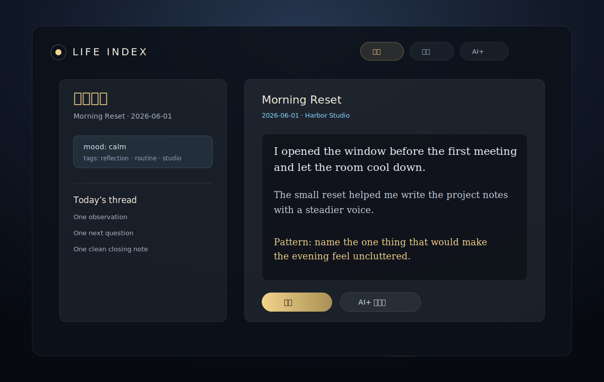
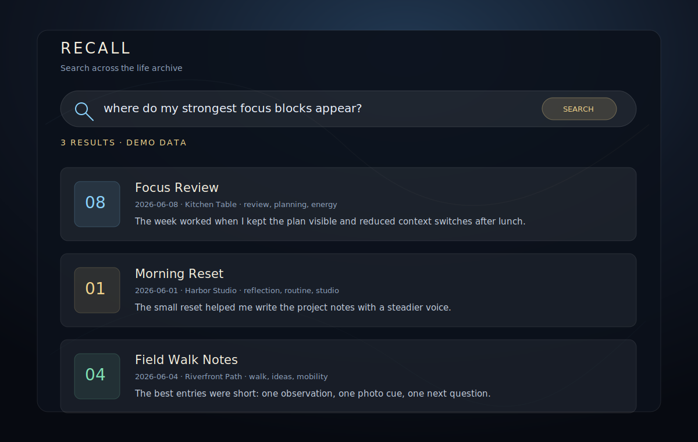
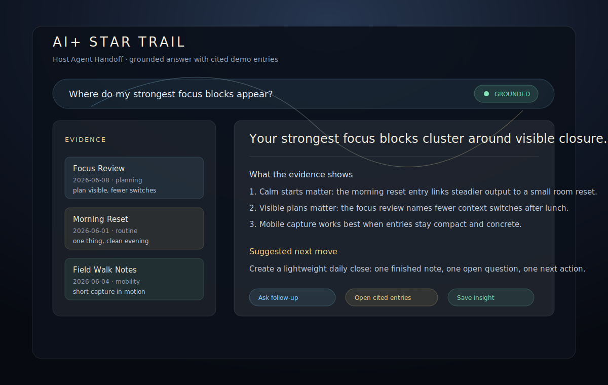
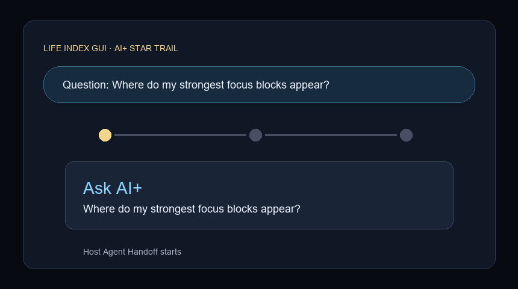

# Life Index GUI | 人生索引

<p align="center">
  <strong>Life Index CLI 服务 Agent; Life Index GUI 服务人类用户。</strong><br />
  把人生档案交给 Agent 打理。GUI 是在那之上、为「人」造的体验层。<br />
  <a href="README.en.md">English</a> · Apache-2.0 · React + FastAPI · Built on Life Index CLI
</p>

<p align="center">
  
</p>

## 导航

[体验](#体验) · [智能](#智能-ai-星轨) · [走出家门](#走出家门) · [快速开始](#快速开始) · [架构](#架构--与-cli-关系)

## TL;DR

Life Index CLI 是给 Agent 的原生工具层；Life Index GUI 是给人类用户的体验层。CLI 负责可靠的数据与能力边界，GUI 负责把写入、搜索、回看、移动访问和 AI+ 结果呈现成一个可以长期使用的界面。

三根支柱：

- **为「人」而造的体验层**：人机共生时代，人类体验同样值得被认真对待。
- **媲美艺术独立游戏的 UI/UX**：在合理性能开销下追求有审美、有节奏、有沉浸感的个人知识界面。
- **走出家门的移动性**：Agent 留在家中主机上运行，Life Index 通过安全的临时访问路径装进手机。

## 体验

Life Index 的底层能力适合 Agent 调用，但人需要可扫描、可停留、可反复使用的界面。GUI 把写入、搜索、归档、维护和 AI+ 回答放在同一个视觉空间里，让人生档案不只是命令输出。

<p align="center">
  
</p>

## UI/UX

Life Index GUI 的目标不是普通后台表单，而是接近艺术独立游戏的体验密度：星轨、层级、光感、节奏和可读性一起服务长期回看。未来会开放更多主题视觉模板与可定制元素。

## 智能 AI+ 星轨

AI+ 星轨把问题交给你的宿主 agent，由宿主 agent 使用 Life Index CLI 检索证据并合成回答。GUI 只负责发起 handoff、显示证据、状态、引用和回答；它不内置模型、不选择供应商、不假装自己有心智。

没接宿主 agent 时，AI+ 会诚实显示 offline / unavailable。写入、关键词搜索和本地浏览仍然可用。

<p align="center">
  
</p>

<p align="center">
  
</p>

## 走出家门

移动性让 Life Index 不只待在桌面。桌面主机继续运行 CLI、GUI backend 和宿主 agent；你可以通过临时 token-gated 公网链接在手机上打开 GUI，记录路上、旅途和生活现场的片段。

公网链接是显式风险操作：目前仅支持 `cloudflared` Quick Tunnel，由仓库内 `scripts/start-mobile-cloudflare-tunnel.ps1` 启动稳定移动服务器并生成一次性 code 保护的临时链接；不支持 SSH/ngrok/frp 路径。用完应立即停止。生成失败时 GUI 会 fail-closed，不暴露半配置入口。

## 快速开始

前置：

- Node.js 22+
- Python 3.12-3.13（当前依赖的 `pydantic-core` / `Pillow` 尚未覆盖 Python 3.14 wheel）
- Life Index CLI 已安装并可在本机运行
- 可选：宿主 agent，用于 AI+ grounded answer / smart metadata
- 可选：`cloudflared`，用于临时手机访问（唯一支持的公网隧道）

```bash
git clone https://github.com/DrDexter6000/life-index-gui.git
cd life-index-gui
npm ci --include=dev
python -m venv .venv
source .venv/bin/activate   # Windows PowerShell: .venv\Scripts\Activate.ps1
pip install -r backend/requirements.txt
```

GUI 的本地开发、测试和构建工具（`vite` / `typescript` / `vitest` / `eslint` / `tailwindcss`）都在 devDependencies；`npm ci --include=dev` 可抵消 `NODE_ENV=production` 或 `npm config omit=dev`，避免 `vite: not found` 或构建失败。

终端 1，启动 backend：

```bash
python -m uvicorn backend.main:app --host 127.0.0.1 --port 8000
```

终端 2，启动 frontend：

```bash
npm run dev
```

打开：

```text
http://127.0.0.1:5173
```

生产构建：

```bash
npm run build
```

## 架构 / 与 CLI 关系

```text
Human -> Life Index GUI -> FastAPI backend -> Life Index CLI -> local archive
Human -> Life Index GUI -> FastAPI backend -> optional host agent -> Life Index CLI
```

- **CLI** 是数据与能力的 SSOT。它面向 Agent，提供确定性的写入、搜索、维护与索引工具。
- **Host agent** 是智能层。它规划、检索、推理、合成，并选择自己的模型/运行时。
- **GUI** 是体验层。它呈现 CLI-backed 数据，转发 AI+ handoff，显示证据和状态。
- **数据与程序分离**。GUI/backend 不直接读写 journals、附件、索引、SQLite 缓存、实体图谱或用户数据目录；持久数据访问必须经过 CLI contract。

## 设计与贡献

- 设计 tokens：[design/tokens.json](design/tokens.json)
- 架构：[docs/ARCHITECTURE.md](docs/ARCHITECTURE.md)
- GUI/CLI contract：[docs/GUI_CLI_CONTRACT.md](docs/GUI_CLI_CONTRACT.md)
- 文档索引：[docs/README.md](docs/README.md)

## License

Apache-2.0
